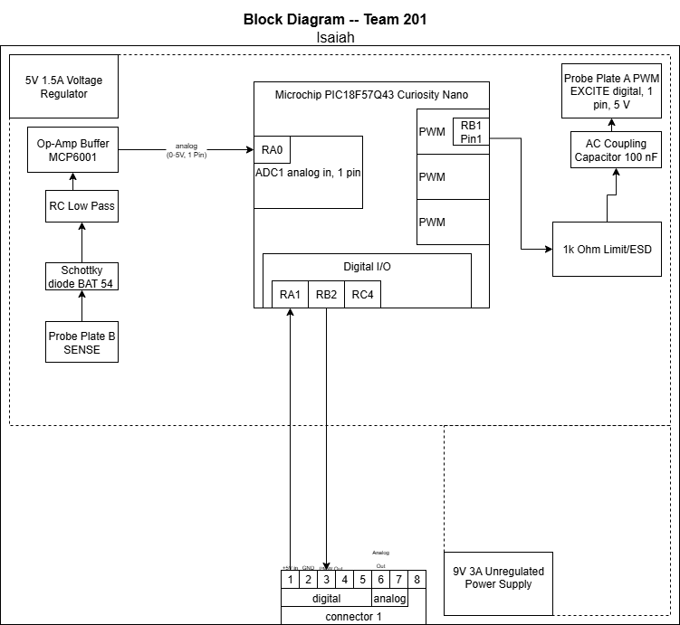

## Overview
This moisture sensor block diagram exists to show the basic construction of the sensing subsystem of the Garden Buddy product. The sensor is connected to the motor control board allowing irrication to occur only at certain moisture levels.

## Moisture Sensor Block Diagram 

