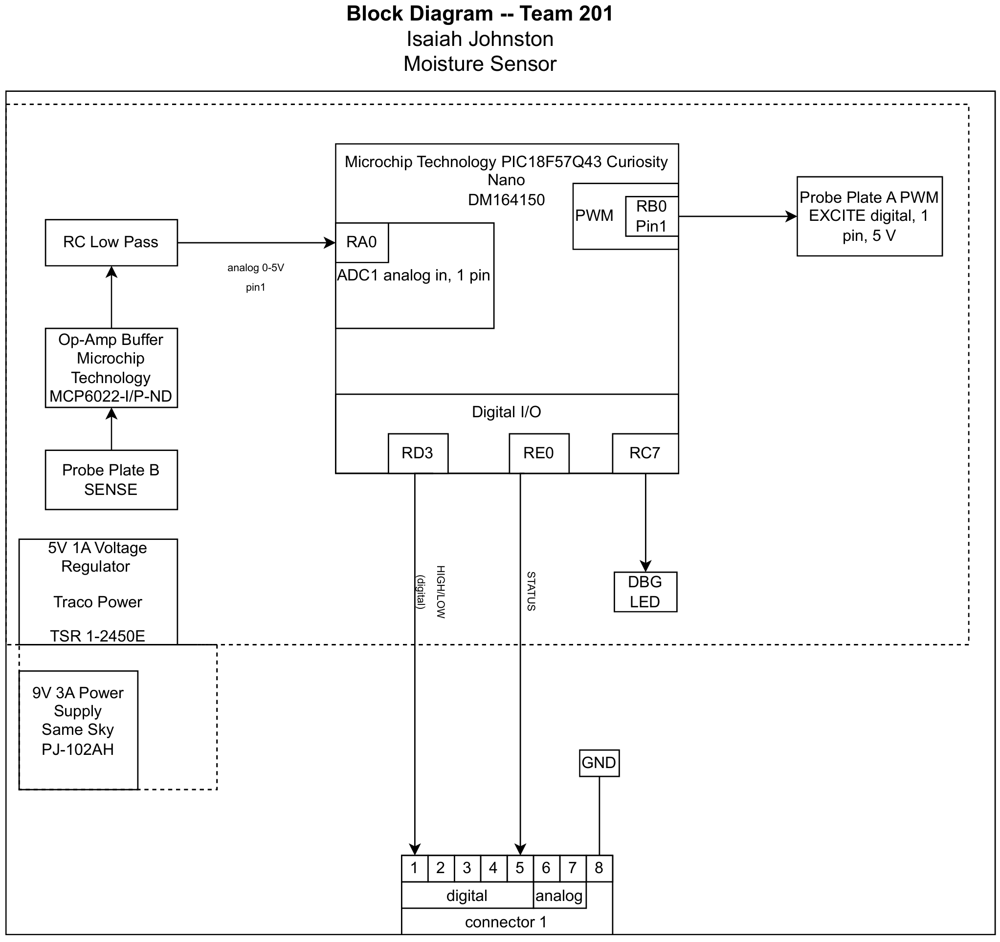

## Overview
This moisture sensor block diagram exists to show the basic construction of the sensing subsystem of the Garden Buddy product. The 9V power supply takes wall power and coverts it to 9V then sends the power to the 5V voltage regulator. The voltage regulator powers the folloing components.Pin RB0 of the Curiosity Nano will send a square wave to Probe Plate A which will cause a build up of charge in the node. The soil will act as the dielectric in a capacitor, the moisture level of the soil will change its capacitance. When the soil has charged it will discharge into Probe Plate B. The signal is sent to the Op-Amp and low pass filter to be amplified and filtered. The signal is recieved by RA0, the Curiosity Nano process the raw data and sends a high or low signal from RD3 to connector pin 1 allowing the moisture sensor subsystem to motor subsystem which acts as a hub. Pin RE0 sends a "proof of life" high signal to the hub and then to the speaker which will sound the alarm if the sensor is broken or shorted. The Debug LED recives a signal from RC7 to aid in proofing code. 

## Moisture Sensor Block Diagram 

