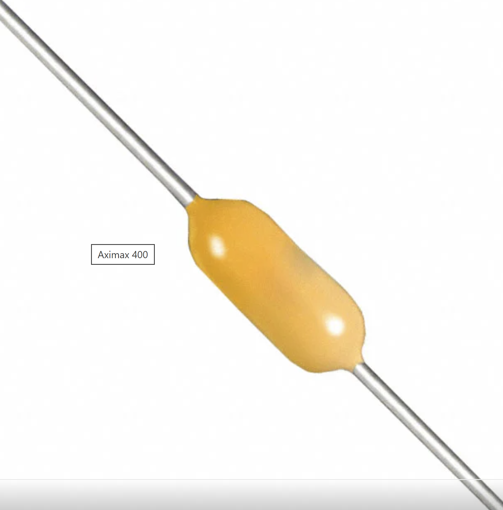

**Sensing and Probe Plate**

| **Solution**                                                                                                                                                                    | **Pros**                                                                                                                                    | **Cons**                                                                                            |
| ------------------------------------------------------------------------------------------------------------------------------------------------------------------------------------------------- | ------------------------------------------------------------------------------------------------------------------------------------------- | --------------------------------------------------------------------------------------------------- |
| Option 1. * Type: Interdigitated Comb Manufacturer: Peralta (made in house)  | \* High sensitivity area of plate \* Good signal to noise ratio \* Low draw allows continuous sensing  | \* High influence from air pockets \* Salty soils can cause shorts.  \* Hard to clean.|
|   \ Option 2.  \* Type: Parallel Plates \* Manufacturer: Peralta (made in house)  \* Design use only | \* Easy to design and etch  \* Low cost   \* Low risk of shorting | * Low overall capacitance  \* Low range of measurement  \* Non-uniform sensing region|
| \(back and front of probe) \ Option 3. \* Type: Multi-layer \* Manufacturer: Peralta (made in house)|* High sensitivity in bulk soil \* Deep measurement \* pairs can be chained to measure at different soil depths|* Higher manufacturing tolerances \* Higher cost \* Probe stiffness makes it susceptible to cracking|

**Choice:Interdigitated Comb**

**Rationale:** The interdigitated comb design has a larger excite and sensing region when compared to a paralel plate design of the same volume. The comb design is easier and cheaper to manucatur than the layered design due to its acceptable tolerence range.

**AC Coupling Capacitor**

| **Solution**                                                                                                                                                                    | **Pros**                                                                                                                                    | **Cons**                                                                                            |
| ------------------------------------------------------------------------------------------------------------------------------------------------------------------------------------------------- | ------------------------------------------------------------------------------------------------------------------------------------------- | --------------------------------------------------------------------------------------------------- |
| Option 1. \* K104K15X7RF5TH5 AC Coupling Capacitor \* Through hole mount \* $0.25/each [Digikey](https://www.digikey.com/en/products/detail/vishay-beyschlag-draloric-bc-components/K104K15X7RF5TH5/286555) | \* Least expensive \* Works over a wide temperature range \* Small footprint| \* Sensitive to humidity \* Moderate dielectric absorption, can cause inaccurate readings \* Accuracy drifts over time|
|  \ Option 2.  \* SC430C104K3G5TA-ND AC Coupling Capacitor \* Through hole mount \* $0.29/each [Digikey](https://www.digikey.com/en/products/detail/kemet/C430C104K3G5TA/6687845) | \* Small footprint \* Good high frequency performance \* Long term reliability |* Lower voltage rating \* Capacitance changes slightly with temperature \* Less but still has some dielectric absorption|
| \ Option 3. \* MKS2D031001A00MSSD AC Coupling Capacitor \* Through hole \* $0.51/each \*[Digikey](https://www.digikey.com/en/products/detail/wima/MKS2D031001A00MSSD/9370574) |* Low DC leakage \* Low Dielectric absorption \* Resistant to moisture and mechanical stress|* Largest of the options \* Most expensive \* The rigidity can stress solder joints if jostled or vibrated|

**Choice:C430C104K3G5TA-ND**

**Rationale:** The C430C104K3G5TA-ND will be chosen for its price and reliability. It is less susceptible to humidity and moisture error due to its sealed construction.

**Schottky Diode**

| **Solution**                                                                                                                                                                    | **Pros**                                                                                                                                    | **Cons**                                                                                            |
| ------------------------------------------------------------------------------------------------------------------------------------------------------------------------------------------------- | ------------------------------------------------------------------------------------------------------------------------------------------- | --------------------------------------------------------------------------------------------------- |
| Option 1. \* 1N5819 \* Schottky Diode \* $0.13/each [Digikey](https://www.digikey.com/en/products/detail/stmicroelectronics/1N5819/1037326) | \* Resilient under heat \* Low cost \* High surge current tolerance| \* Higher Vf can reduce efficiency in dry soil \* High junction capacitance \* Bulky|
|  \ Option 2.  \* BAT85S-TAP \* Schottky Diode \* $0.14/each [Digikey](https://www.digikey.com/en/products/detail/vishay-general-semiconductor-diodes-division/BAT85S-TAP/3104127) | \* Low Vf \* Small footprint \* Fast switching |* Low current rating \* Low surge capability \* Fragile packaging|
| \ Option 3. \* 1N5817 \* Schottky Diode \* $0.14/each \*[Digikey](https://www.digikey.com/en/products/detail/stmicroelectronics/1N5817/770963) |*Fast recovery \* Low noise \* Lower Vf than 1N5819|* Bulky \* Large reverse leakage current \* Higher temperatures can cause drift|

**Choice:BAT85S-TAP**

**Rationale:** The BAT85S-TAP will be used for its fast switching capability, low forward drop, and low leakage.

  **Op-Amp Buffer**

| **Solution**                                                                                                                                                                    | **Pros**                                                                                                                                    | **Cons**                                                                                            |
| ------------------------------------------------------------------------------------------------------------------------------------------------------------------------------------------------- | ------------------------------------------------------------------------------------------------------------------------------------------- | --------------------------------------------------------------------------------------------------- |
| Option 1. \* LM358P \* Op-Amp buffer \* $0.27/each [Digikey](https://www.digikey.com/en/products/detail/texas-instruments/LM358P/277042) | \* Resilient under heat \* Low cost \* High surge current tolerance| \* Higher Vf can reduce efficiency in dry soil \* High junction capacitance \* Bulky|
|  \ Option 2.  \* CA3240EZ \* Op-Amp buffer \* $3.19/each [Digikey](https://www.digikey.com/en/products/detail/renesas-electronics-corporation/CA3240EZ/821389) | \* Fast slew \* Low input bias \* Good bandwidth |* Not rail to rail I/O \* Noticable drift with temperature \* Input noise|
| \ Option 3. \* MCP6022-I/P \* Op-Amp buffer \* $1.86/each \*[Digikey](https://www.digikey.com/en/products/detail/microchip-technology/MCP6022-I-P/417828) |*Low input bias \* Fast slew \* Low offset|* Low drift with temperature rise \*Small baseline drift \*At risk of latchup potentially causing damage to the part|

**Choice: MCP6022-I/P**

**Rationale:** The MCP6022-I/P will be used for its low bias, and fast slew rate. Consuming minimal power and sending a clean signal.
**

| **Solution**                                                                                                                                                                    | **Pros**                                                                                                                                    | **Cons**                                                                                            |
| ------------------------------------------------------------------------------------------------------------------------------------------------------------------------------------------------- | ------------------------------------------------------------------------------------------------------------------------------------------- | --------------------------------------------------------------------------------------------------- |
| Option 1. \* L7805CV \* Linear Regulator \* $0.50/each [Digikey](https://www.digikey.com/en/products/detail/stmicroelectronics/L7805CV/585964) | \* Lowest cost \* Low noise \* No switching spikes| \* Energy inefficient \* Generates heat which could throw readings or introduce condensation \* Higher idle drain|
|  \ Option 2.  \* TSR 1-2450E \* Switching Regulator \* $3.40/each [Digikey](https://www.digikey.com/en/products/detail/traco-power/TSR-1-2450E/12171283?s=N4IgTCBcDaICoCcCGBjA9gAjgZQEoFoBGfMAFgFYAGEAXQF8g) | \* Low heat \* Energy efficient \* Low idle draw |* Most expensive \* Higher output ripple \* Higher electromagnetic interference|
| \ Option 3. \* LM2596S-5.0 \* Switching Regulator \* $3.32/each \*[Digikey](https://www.digikey.com/en/products/detail/umw/LM2596S-5-0/16705901) |*Good efficiency \* Operates in a wide voltage range \* High current headroom|* Noisier than other options \* High Idle draw \* Needs tuning/ Extra QA for productions runs|

**Choice:TSR 1-2450E**

**Rationale:** The TSR 1-2450E will be used for its efficiency in stepping down power while producing low heat, and stable output under load.

**Power Supply**

| **Solution**                                                                                                                                                                    | **Pros**                                                                                                                                    | **Cons**                                                                                            |
| ------------------------------------------------------------------------------------------------------------------------------------------------------------------------------------------------- | ------------------------------------------------------------------------------------------------------------------------------------------- | --------------------------------------------------------------------------------------------------- |
| Option 1. \* 16-00030 AC/DC WALL MOUNT ADAPTER 12V 6W \* Wall outlet power supply \* $6.77/each *[Digikey](https://www.digikey.com/en/products/detail/tensility-international-corp/16-00030/10324409?gclsrc=aw.ds&gad_source=1&gad_campaignid=20232005509&gbraid=0AAAAADrbLlhDPP3OBpG5nKxDHh9GweBbP&gclid=CjwKCAjw3tzHBhBREiwAlMJoUr_wV-gGGldVXDYFfLn7gjQ5H6BAUQ0fgq_vArBnfdnLXE7DjR_N5xoCaXwQAvD_BwE) | \*Lowest cost \* Constant power \* Clean supply| \* Not portable \* Limited use without extension cords \* Indoor use only|
|   Option 2.  \* RadioMaster 5000mAh 2S 7.4V Li-ion Battery with XT30 Connector \* Rechargeable power supply \* $25.99/each [MotionRC](https://www.motionrc.com/products/radiomaster-5000mah-2s-7-4v-li-ion-battery-with-xt30-connector-hp0157-batt-5a2s?srsltid=AfmBOoouwp1tw2VWueXsnK8W4uQuzwqAE6nUhBdlDAyu8GNJax9JY2X0) | \* Long runtime \* Compact \* Easy connection |* Highest cost \* Performance loss at freezing and high heat \* Risk of over voltage spikes|
| \ Option 3. \* 2440 BATT HOLDER AA 4 CELL 6" LEADS \* Replacable power supply \* $9.68/each \*[Digikey](https://www.digikey.com/en/products/detail/keystone-electronics/2440/9561058?gclsrc=aw.ds&gad_source=1&gad_campaignid=20243136172&gbraid=0AAAAADrbLliKbEh2iWNss6PAqtweLuMmH&gclid=CjwKCAjw3tzHBhBREiwAlMJoUjfBbA3qv7wjORBrH5ku49U_r9DPOGB7L7E-aR4IS9pyWZ6hrcpbbhoCxeoQAvD_BwE) |*User can easily replace cells \* Low cost to replace cells \* Safer for users than a Li-ion battery|*Lower energy density \* Not weather proof \* More affected by weather than Li-ion|

**Choice:RadioMaster 5000mAh 2S 7.4V Li-ion Battery**

**Rationale:** The RadioMaster 5000mAh 2S 7.4V Li-ion Battery with XT30 Connector will be used for its long battery life and compact nature.

**Connector Header**

| **Solution**                                                                                                                                                                    | **Pros**                                                                                                                                    | **Cons**                                                                                            |
| ------------------------------------------------------------------------------------------------------------------------------------------------------------------------------------------------- | ------------------------------------------------------------------------------------------------------------------------------------------- | --------------------------------------------------------------------------------------------------- |
| Option 1. \* TB002-500-02BE TERMINAL BLOCK, SCREW TYPE, 5.00 \* Wire connection \* $0.40/each [Digikey](https://www.digikey.com/en/products/detail/same-sky-formerly-cui-devices/TB002-500-02BE/10064069) | \* Least expensive \* Flexible connections \* Secure connection| \* Bulky \* Slower assembly/Slow production \* Screws can back off with vibration|
|  \ Option 2.  \* EBC04MMMD CONN CARDEDGE MALE 8POS 0.100 \* Board-to-board connection \* $2.69/each [Digikey]([http://EBC04MMMD-ND](https://www.digikey.com/en/products/detail/sullins-connector-solutions/EBC04MMMD/4538822?s=N4IgTCBcDaIKICEDCAGALAWSwEQARIHkA5I-AQQCVs5sBxOXDMgGQYA4AFAgZVxQDoAjChQgAugF8gA)) | \* Compact \* Short signal path = good integrity \* Makes board easily swapable |* No flexibility \* Most expensive \* Non Locking|
| \ Option 3. \* 215570-8 CONN DIP HDR IDC 8POS 28AWG PCB \* Ribbon connection \* $0.81/each \*[Digikey]([https://www.digikey.com/en/products/detail/stmicroelectronics/1N5817/770963](https://www.digikey.com/en/products/detail/te-connectivity-amp-connectors/215570-8/4142495)) |*Flexible connections \* Fast attachment and detachment \* Keyed to prevent incorrect plug in|* Not sealed \* Limited current \* No strain relief|

**Choice:215570-8 CONN DIP HDR IDC 8POS 28AWG PCBP**

**Rationale:** The 215570-8 CONN DIP HDR IDC 8POS 28AWG PCB will be used for flexibility, modularity, and ease of assembly of the ribbon connection.
