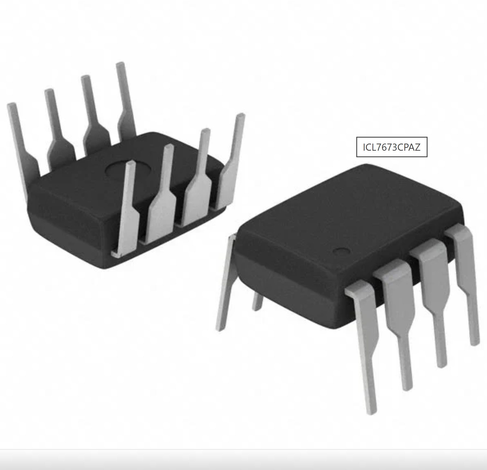
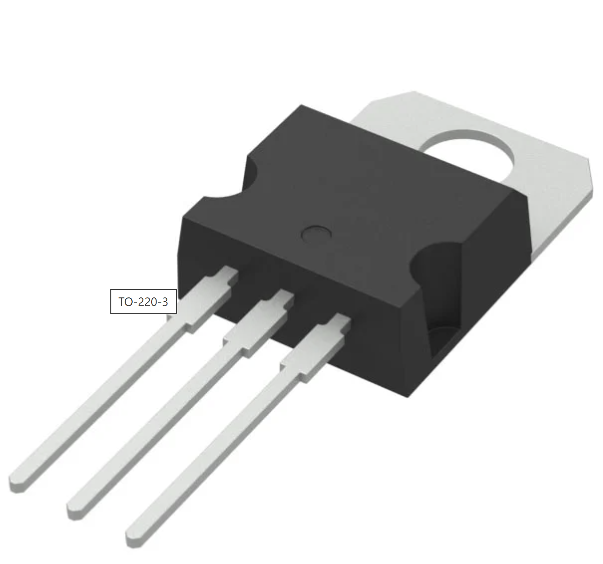
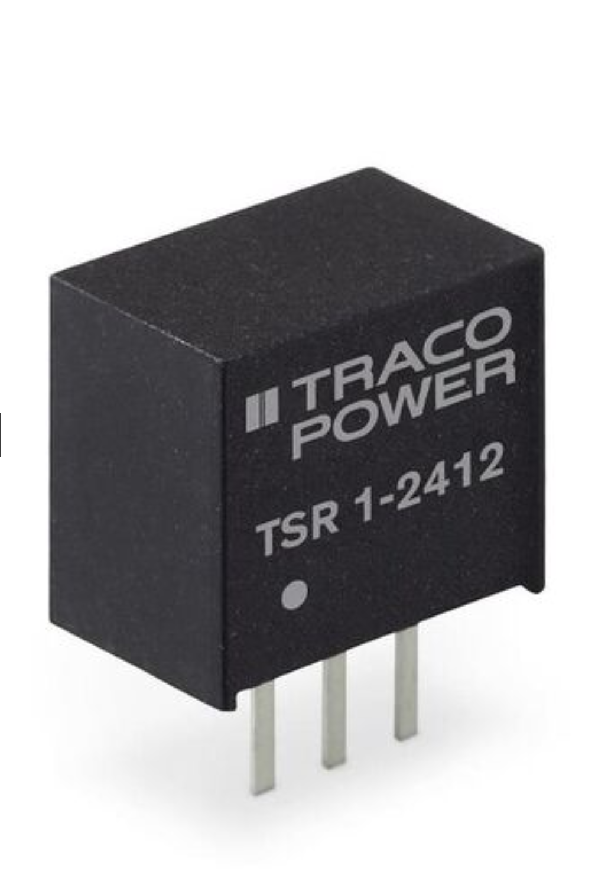
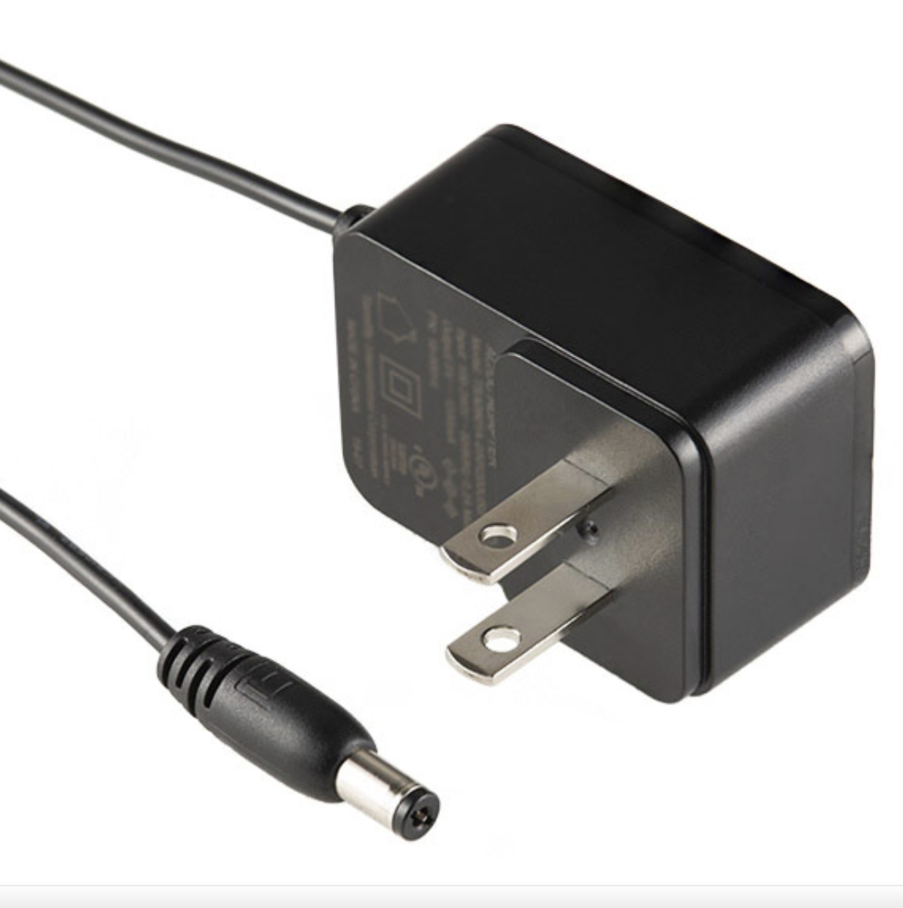
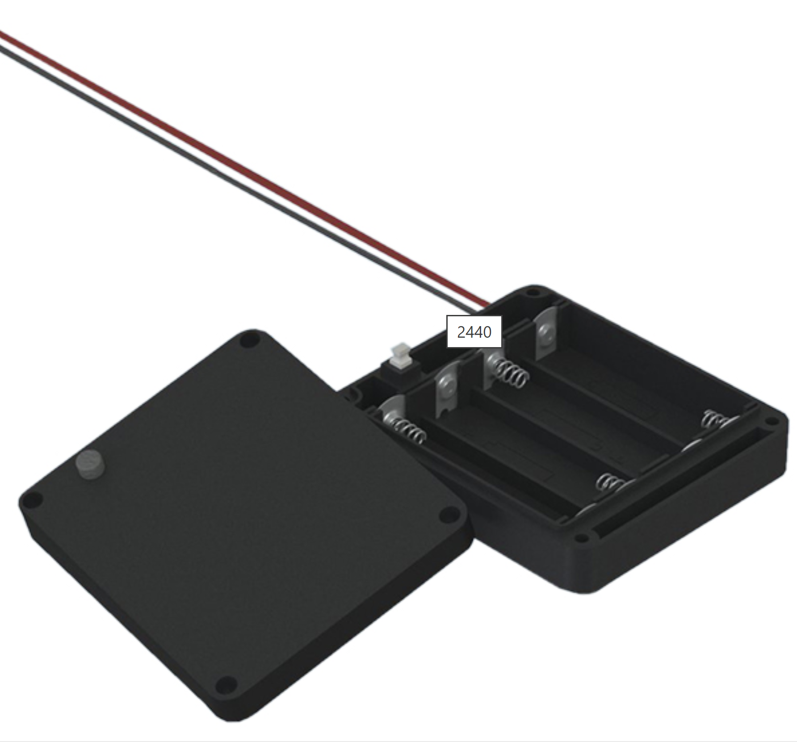
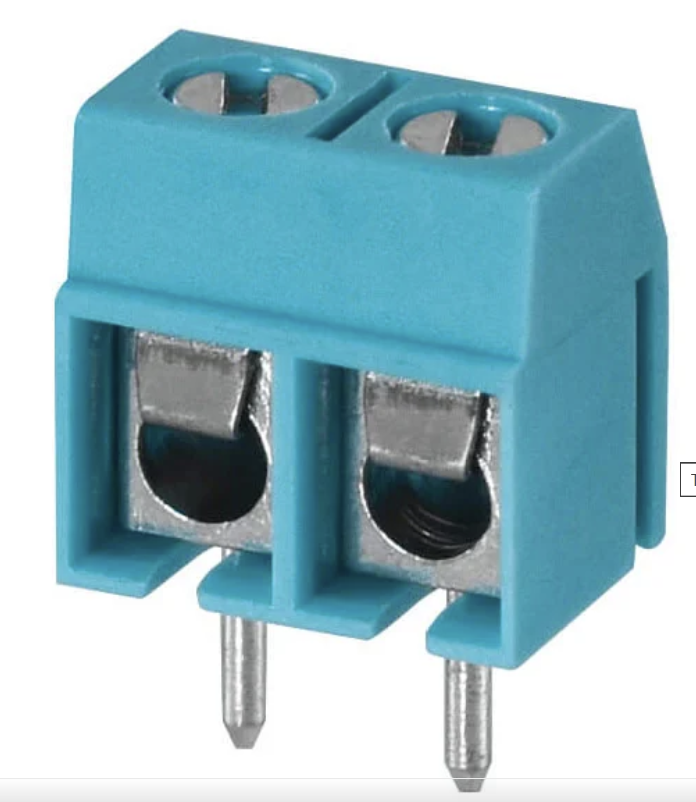

**Sensing and Probe Plate**

| **Solution**                                                                                                                                                                    | **Pros**                                                                                                                                    | **Cons**                                                                                            |
| ------------------------------------------------------------------------------------------------------------------------------------------------------------------------------------------------- | ------------------------------------------------------------------------------------------------------------------------------------------- | --------------------------------------------------------------------------------------------------- |
|{width=70%} Option 1. * Type: Interdigitated Comb Manufacturer: Peralta (made in house)  | \* High sensitivity area of plate \* Good signal to noise ratio \* Low draw allows continuous sensing  | \* High influence from air pockets \* Salty soils can cause shorts.  \* Hard to clean.|
|  {width=70%} \ Option 2.  \* Type: Parallel Plates \* Manufacturer: Peralta (made in house)  \* Design use only | \* Easy to design and etch  \* Low cost   \* Low risk of shorting | * Low overall capacitance  \* Low range of measurement  \* Non-uniform sensing region|
|{width=20% height=10%}{ width=20% height=10%} \(back and front of probe)  Option 3. \* Type: Multi-layer \* Manufacturer: Peralta (made in house)|* High sensitivity in bulk soil \* Deep measurement \* pairs can be chained to measure at different soil depths|* Higher manufacturing tolerances \* Higher cost \* Probe stiffness makes it susceptible to cracking|

**Choice:Interdigitated Comb**

**Rationale:** The interdigitated comb design has a larger excite and sensing region when compared to a paralel plate design of the same volume. The comb design is easier and cheaper to manucatur than the layered design due to its acceptable tolerence range.

  **Op-Amp Buffer**

| **Solution**                                                                                                                                                                    | **Pros**                                                                                                                                    | **Cons**                                                                                            |
| ------------------------------------------------------------------------------------------------------------------------------------------------------------------------------------------------- | ------------------------------------------------------------------------------------------------------------------------------------------- | --------------------------------------------------------------------------------------------------- |
|{width=70%} Option 1. \* LM358P \* Op-Amp buffer \* $0.27/each [Digikey](https://www.digikey.com/en/products/detail/texas-instruments/LM358P/277042) | \* Resilient under heat \* Low cost \* High surge current tolerance| \* Higher Vf can reduce efficiency in dry soil \* High junction capacitance \* Bulky|
| {width=70%} \ Option 2.  \* CA3240EZ \* Op-Amp buffer \* $3.19/each [Digikey](https://www.digikey.com/en/products/detail/renesas-electronics-corporation/CA3240EZ/821389) | \* Fast slew \* Low input bias \* Good bandwidth |* Not rail to rail I/O \* Noticable drift with temperature \* Input noise|
|{width=70%} \ Option 3. \* MCP6022-I/P \* Op-Amp buffer \* $1.86/each \*[Digikey](https://www.digikey.com/en/products/detail/microchip-technology/MCP6022-I-P/417828) |*Low input bias \* Fast slew \* Low offset|* Low drift with temperature rise \*Small baseline drift \*At risk of latchup potentially causing damage to the part|

**Choice: MCP6022-I/P**

**Rationale:** The MCP6022-I/P will be used for its low bias, and fast slew rate. Consuming minimal power and sending a clean signal.

| **Solution**                                                                                                                                                                    | **Pros**                                                                                                                                    | **Cons**                                                                                            |
| ------------------------------------------------------------------------------------------------------------------------------------------------------------------------------------------------- | ------------------------------------------------------------------------------------------------------------------------------------------- | --------------------------------------------------------------------------------------------------- |
|{width=70%} Option 1. \* L7805CV \* Linear Regulator \* $0.50/each [Digikey](https://www.digikey.com/en/products/detail/stmicroelectronics/L7805CV/585964) | \* Lowest cost \* Low noise \* No switching spikes| \* Energy inefficient \* Generates heat which could throw readings or introduce condensation \* Higher idle drain|
| {width=70%} \ Option 2.  \* TSR 1-2450E \* Switching Regulator \* $3.40/each [Digikey](https://www.digikey.com/en/products/detail/traco-power/TSR-1-2450E/12171283?s=N4IgTCBcDaICoCcCGBjA9gAjgZQEoFoBGfMAFgFYAGEAXQF8g) | \* Low heat \* Energy efficient \* Low idle draw |* Most expensive \* Higher output ripple \* Higher electromagnetic interference|
|{width=70%} \ Option 3. \* LM2596S-5.0 \* Switching Regulator \* $3.32/each \*[Digikey](https://www.digikey.com/en/products/detail/umw/LM2596S-5-0/16705901) |*Good efficiency \* Operates in a wide voltage range \* High current headroom|* Noisier than other options \* High Idle draw \* Needs tuning/ Extra QA for productions runs|

**Choice:TSR 1-2450E**

**Rationale:** The TSR 1-2450E will be used for its efficiency in stepping down power while producing low heat, and stable output under load.

**Revision 1.1:** Due to the lack of support documentation for the TSR 1-2450E a change was made to the LM2575-5.0WT. The manufacturer, Microtech Technologies, provides goood recources on the exact way to build the circuit for a functioning voltage regulator.{width=70%}

**Power Supply**

| **Solution**                                                                                                                                                                    | **Pros**                                                                                                                                    | **Cons**                                                                                            |
| ------------------------------------------------------------------------------------------------------------------------------------------------------------------------------------------------- | ------------------------------------------------------------------------------------------------------------------------------------------- | --------------------------------------------------------------------------------------------------- |
|{width=70%} Option 1. \* 16-00030 AC/DC WALL MOUNT ADAPTER 12V 6W \* Wall outlet power supply \* $6.77/each *[Digikey](https://www.digikey.com/en/products/detail/tensility-international-corp/16-00030/10324409?gclsrc=aw.ds&gad_source=1&gad_campaignid=20232005509&gbraid=0AAAAADrbLlhDPP3OBpG5nKxDHh9GweBbP&gclid=CjwKCAjw3tzHBhBREiwAlMJoUr_wV-gGGldVXDYFfLn7gjQ5H6BAUQ0fgq_vArBnfdnLXE7DjR_N5xoCaXwQAvD_BwE) | \*Lowest cost \* Constant power \* Clean supply| \* Not portable \* Limited use without extension cords \* Indoor use only|
| {width=70%}  Option 2.  \* RadioMaster 5000mAh 2S 7.4V Li-ion Battery with XT30 Connector \* Rechargeable power supply \* $25.99/each [MotionRC](https://www.motionrc.com/products/radiomaster-5000mah-2s-7-4v-li-ion-battery-with-xt30-connector-hp0157-batt-5a2s?srsltid=AfmBOoouwp1tw2VWueXsnK8W4uQuzwqAE6nUhBdlDAyu8GNJax9JY2X0) | \* Long runtime \* Compact \* Easy connection |* Highest cost \* Performance loss at freezing and high heat \* Risk of over voltage spikes|
|{width=70%} \ Option 3. \* 2440 BATT HOLDER AA 4 CELL 6" LEADS \* Replacable power supply \* $9.68/each \*[Digikey](https://www.digikey.com/en/products/detail/keystone-electronics/2440/9561058?gclsrc=aw.ds&gad_source=1&gad_campaignid=20243136172&gbraid=0AAAAADrbLliKbEh2iWNss6PAqtweLuMmH&gclid=CjwKCAjw3tzHBhBREiwAlMJoUjfBbA3qv7wjORBrH5ku49U_r9DPOGB7L7E-aR4IS9pyWZ6hrcpbbhoCxeoQAvD_BwE) |*User can easily replace cells \* Low cost to replace cells \* Safer for users than a Li-ion battery|*Lower energy density \* Not weather proof \* More affected by weather than Li-ion|

**Choice: 16-00030 AC/DC WALL MOUNT ADAPTER 12V 6W**

**Rationale:** 16-00030 AC/DC WALL MOUNT ADAPTER 12V 6W, will be used for its convenience and easy of use.

**Revision 1.1:** The initial choice was abandoned for the class provided 237-1449-ND 9V power supply. This was done to save money. There was no obvious reason to chose another power supply.{width=70%}

**Connector Header**

| **Solution**                                                                                                                                                                    | **Pros**                                                                                                                                    | **Cons**                                                                                            |
| ------------------------------------------------------------------------------------------------------------------------------------------------------------------------------------------------- | ------------------------------------------------------------------------------------------------------------------------------------------- | --------------------------------------------------------------------------------------------------- |
|{width=70%) Option 1. \* TB002-500-02BE TERMINAL BLOCK, SCREW TYPE, 5.00 \* Wire connection \* $0.40/each [Digikey](https://www.digikey.com/en/products/detail/same-sky-formerly-cui-devices/TB002-500-02BE/10064069) | \* Least expensive \* Flexible connections \* Secure connection| \* Bulky \* Slower assembly/Slow production \* Screws can back off with vibration|
| {width=70%} \ Option 2.  \* EBC04MMMD CONN CARDEDGE MALE 8POS 0.100 \* Board-to-board connection \* $2.69/each [Digikey]([http://EBC04MMMD-ND](https://www.digikey.com/en/products/detail/sullins-connector-solutions/EBC04MMMD/4538822?s=N4IgTCBcDaIKICEDCAGALAWSwEQARIHkA5I-AQQCVs5sBxOXDMgGQYA4AFAgZVxQDoAjChQgAugF8gA)) | \* Compact \* Short signal path = good integrity \* Makes board easily swapable |* No flexibility \* Most expensive \* Non Locking|
|{width=70%} \ Option 3. \* 215570-8 CONN DIP HDR IDC 8POS 28AWG PCB \* Ribbon connection \* $0.81/each \*[Digikey]([https://www.digikey.com/en/products/detail/stmicroelectronics/1N5817/770963](https://www.digikey.com/en/products/detail/te-connectivity-amp-connectors/215570-8/4142495)) |*Flexible connections \* Fast attachment and detachment \* Keyed to prevent incorrect plug in|* Not sealed \* Limited current \* No strain relief|

**Choice:215570-8 CONN DIP HDR IDC 8POS 28AWG PCBP**

**Rationale:** The 215570-8 CONN DIP HDR IDC 8POS 28AWG PCB will be used for flexibility, modularity, and ease of assembly of the ribbon connection.
**Future Revision** The initial choice was incorrect for the provided ribbon connector. A choice like the TSW-104-07-F-D would be more suited for the role.{width=70%}
