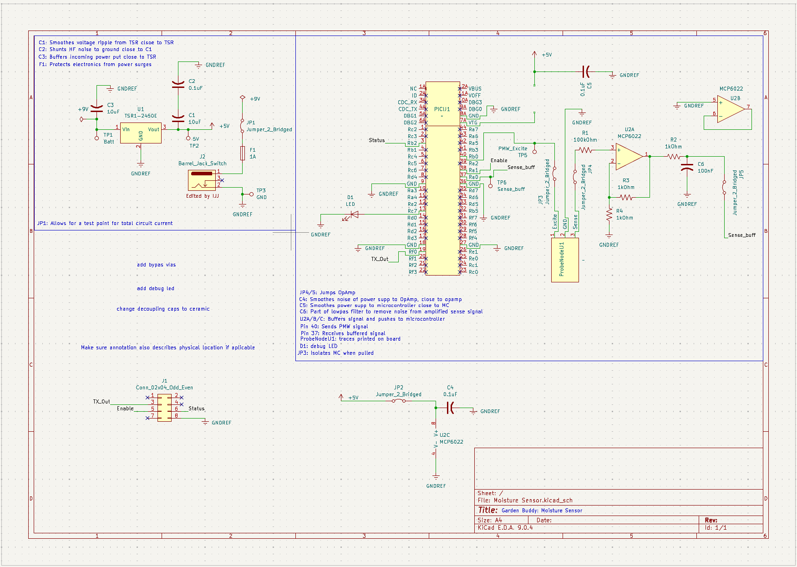

## Overview

This schematic is to support the construction and wiring of the sensing PCB of the Garden Buddy

{style width:"350" height:"300;"}

## Resouces

The schematic as a PDF download is available [*here*](Moistschemv2.pdf), and the Zip folder of the project [*here*](Moisture%20Sensor-2025-10-31_161931.zip).
