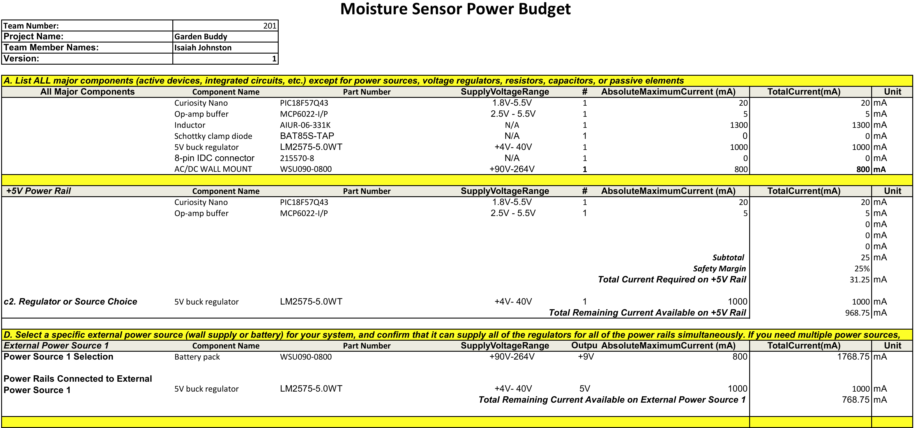

## Overview
This power budget describes the power needs of each major component

> Capture your power budge as a image to display. Take time to get clean breaks and a well organized layout.

{style width:"350" height:"300;"}

## Conclusions

Power needs should be met with the chosen power source. A 1 amp fuse will be put infront of the power source to protect against surges when plugging in the power source.

## Resouces

The power budget as a PDF download is available [*here*](POWERBGTV3.pdf), and a Microsoft Excel Sheet [*here*](POWERBGTV3.xlsx).
