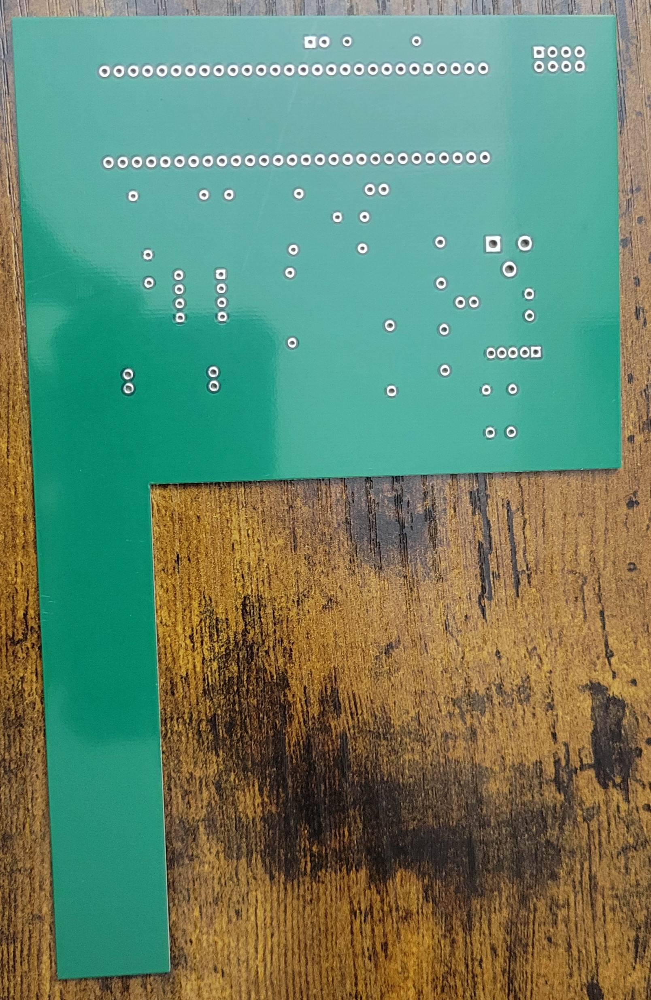
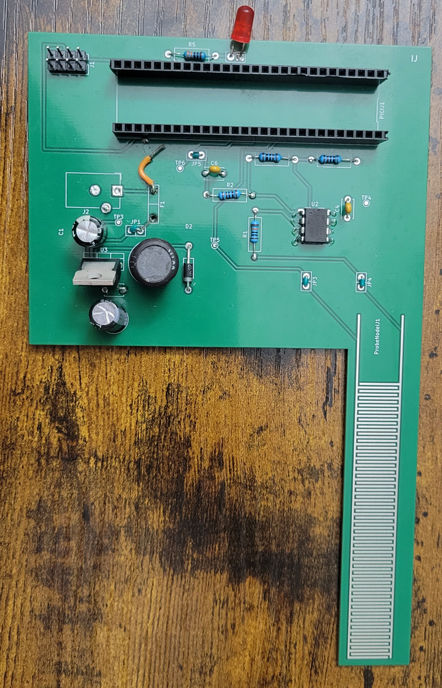

## Overview

This PCB design is to support fabrication of the sensing PCB of the Garden Buddy. Below is ECAD representation of the printed board.

{style width:"350" height:"300;"}

The following image is the functioning version of the sensor used to test the components and circuit.

{style width:"350" height:"300;"}

The following image is the front of an unpopulated moisture sensor PCB.

{style width:"350" height:"300"}

The following image is the back of an unpopulated moisture sensor PCB.

{style width:"350" height:"300"}

The following image is of a populated but broken moisture sensing PCB.

{style width:"350" height:"300"}

## Resouces

The GBR and drill files are available [*here*](MoistSenseV5.zip), and the Zip folder of the project [*here*](Moisture%20Sensor-2025-12-08_024201.zip).
